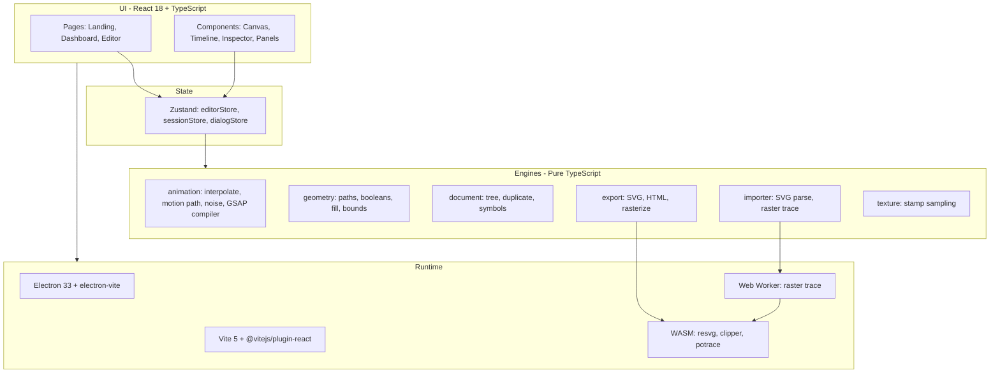

# svgAnimeto — Product & Feature Documentation

Complete reference for what svgAnimeto is, what you can do with it, the technology behind it, and how every major feature works (user flow + implementation).

**Related docs:** [User guide](user-guide.md) (short how-to) · [Architecture](architecture-and-modules.md) (module map for developers)

---

## Table of contents

1. [What is the product?](#1-what-is-the-product)
2. [What can we do?](#2-what-can-we-do)
3. [Tech stack](#3-tech-stack)
4. [Features (detailed)](#4-features-detailed)

---

## 1. What is the product?

**svgAnimeto** is a desktop-first (with a web build) visual editor for **SVG design** and **timeline-based vector animation**. It targets designers and motion artists who want to create, animate, and export vector graphics without leaving a single app.

### Core value

| Need | How svgAnimeto addresses it |
|------|-----------------------------|
| Draw vector art | Built-in shapes, pen, pencil, brush, fill, eraser, text, path editing |
| Animate properties | Keyframe timeline per layer and property (transform, colors, path morph, motion paths) |
| Reuse motion | Symbols with independent timelines; animation presets |
| Review motion | Fullscreen pre-rendered preview (smooth playback) |
| Ship assets | Export animated SVG (CSS `@keyframes`), HTML, GIF, or video |

### Distribution

- **Desktop:** Electron app (`npm run dev` / `npm run dist`) — native menus, file dialogs, project library on disk.
- **Web:** HashRouter build (e.g. [svganimeto-lq3j.vercel.app](https://svganimeto-lq3j.vercel.app/)) — projects persist in **IndexedDB** instead of the OS library.
- **Project file:** JSON serialized as **`.svgmotion`** (elements, tracks, symbols, timing, guides).

### Mental model

The app keeps one **document** (`Project`) in memory, edited through **modes** (Draw → Animate → Preview → Export). All geometry and animation live in **Zustand** (`editorStore`); the React canvas **renders** sampled state. Heavy math (booleans, tracing, raster export) lives in **`src/engines/`** and optional **WebAssembly** backends.

---

## 2. What can we do?

### End-to-end workflows

| Workflow | Summary |
|----------|---------|
| **Create from scratch** | Dashboard → New project → Draw shapes → Animate keyframes → Preview → Export |
| **Import & animate** | Import SVG or trace a raster → assign motion paths / presets → export for web |
| **Reusable components** | Convert layers to **symbols** → place instances → each instance plays the symbol’s internal animation |
| **Organic motion** | **Noise wiggle** on transforms, **texture brushes** along paths, **path morph** between shapes |
| **Collaboration / backup** | Save `.svgmotion` files; open on another machine (Electron) or browser (IndexedDB + file import) |

### By editor mode

| Mode | You can… |
|------|----------|
| **Draw** | All drawing tools, layers, inspector, canvas guides, symbol creation |
| **Animate** | Timeline, keyframes, easing, motion path offset, auto-keyframe, select/hand/path-edit only on toolbar |
| **Preview** | Fullscreen cached-frame playback, FPS override, scrub, loop, speed |
| **Export** | Dialog for SVG / HTML / GIF / video with options |

### By surface

| Surface | Capabilities |
|---------|----------------|
| **Landing** (`#/`) | Marketing page, feature overview, link to dashboard |
| **Dashboard** (`#/dashboard`) | Project library: create, open, delete, refresh |
| **Editor** (`#/editor/:id`) | Full workspace: top bar, tools, canvas, inspector, layers, symbols, timeline |

### Limits & conventions (important)

- **Draw vs Animate:** Switching modes resets playhead to `0`, stops playback, clears selection; entering **Draw** bakes keyframe state at `t=0` into base transforms so Draw always shows the “start pose.”
- **Symbol edit:** Main document is snapshotted; you edit the symbol master in isolation (Draw/Animate/Preview allowed; Export blocked until you finish).
- **Hidden layers** are omitted from all exports.
- **Preview bake** caps memory (~720 frames, max 1280 px long edge) — effective FPS may be lowered on long/heavy projects.

---

## 3. Tech stack

### Application layers

### Dependencies (production)

| Package | Role |
|---------|------|
| **react** / **react-dom** | UI |
| **react-router-dom** | Hash routes: `/`, `/dashboard`, `/editor/:projectId` |
| **zustand** | Editor document, timeline, tools, history, clipboards |
| **gsap** | Playback ticker integration; optional dev timeline compilation |
| **nanoid** | Short unique IDs for elements and keyframes |
| **clsx** | Conditional CSS classes |
| **@fortawesome/** | Toolbar and chrome icons |
| **polygon-clipping** | JS fallback for path booleans |
| **js-angusj-clipper** | WASM Clipper2 for booleans (faster) |
| **@resvg/resvg-wasm** | SVG → bitmap rasterization (preview + export) |
| **esm-potrace-wasm** | Bitmap → vector trace (worker) |
| **gifenc** | GIF export encoding |

### Build & tooling

| Tool | Role |
|------|------|
| **electron-vite** | Separate bundles: `electron/main`, `preload`, renderer |
| **TypeScript 5.7** | Strict typing across renderer and electron |
| **ESLint + Prettier** | Lint and format |
| **electron-builder** | macOS DMG, Windows NSIS, Linux AppImage |

### Security (Electron)

- Renderer has **no** `nodeIntegration`.
- Capabilities exposed only via **preload** `contextBridge` → `window.api` (open/save, import, export, project library).

### Persistence

| Environment | Storage |
|-------------|---------|
| Electron | `electron/projectLibrary.ts` + IPC `projectLibrary:*` |
| Browser | `indexedDbProjectStorage.ts` implementing `ProjectStoragePort` |
| File | `.svgmotion` JSON via `serializeProject` / `hydrateFromJson` in `editorStore` |

### Performance strategy

| Hot path | Primary engine | Fallback |
|----------|----------------|----------|
| Preview / GIF / video frames | `@resvg/resvg-wasm` | Blob URL + `` decode |
| Shape builder / eraser booleans | `js-angusj-clipper` (WASM) | `polygon-clipping` |
| Raster import trace | `esm-potrace-wasm` in worker | Vendored ImageTracer.js |

WASM loaders are **lazy** and **code-split** so cold start stays light (`src/wasm/*/loader.ts`, `wasmFlags.ts`).

---

## 4. Features (detailed)

Each feature below includes:

- **Name** — UI label or internal name  
- **What it does** — behaviour in plain language  
- **User flow** — steps to use it  
- **Implementation** — modules, data, and process  

---

### 4.1 Navigation & project lifecycle

#### Landing page

| | |
|---|---|
| **What** | Public marketing screen at `#/` with hero animation, feature grid, comparison table, GitHub link. |
| **User flow** | Open app → read overview → **Go to dashboard**. |
| **Implementation** | `src/pages/LandingPage.tsx`, `src/styles/landing.css`, GSAP + ScrollTrigger for reveals. Routed in `src/App.tsx`. |

#### Dashboard (project library)

| | |
|---|---|
| **What** | Lists saved projects; create, open, delete, refresh. |
| **User flow** | `#/dashboard` → **New project** or open card → editor URL `#/editor/:projectId`. **Open from disk** uses native dialog (Electron) or file picker (web). |
| **Implementation** | `DashboardPage.tsx` → `HomeScreen.tsx`. Storage via `getProjectStorage()` → `electronProjectStorage` or `indexedDbProjectStorage`. Actions in `src/ipc/projectActions.ts` (`createNewProjectAndOpen`, `openStoredProject`, …). `sessionStore` holds active `ProjectStorageUri`. |

#### Editable project name

| | |
|---|---|
| **What** | Double-click project title in top bar to rename. |
| **User flow** | Double-click **Untitled** (or current name) → type → Enter or blur. |
| **Implementation** | `TopBar.tsx` updates `project.name` through `editorStore`. `onKeyDown` uses `stopPropagation()` so typing does not trigger global shortcuts. |

#### Editor URL persistence

| | |
|---|---|
| **What** | Each open project has a stable hash route for bookmarking. |
| **User flow** | Share or bookmark `http://host/#/editor/abc123`. |
| **Implementation** | `routes.editor` in `navigation.ts`; `EditorPage` loads project by `projectId` via `loadProjectForEditor`. |

---

### 4.2 Editor modes

#### Draw mode

| | |
|---|---|
| **What** | Full tool access; layers-focused bottom layout; base transforms reflect animation at **t = 0**. |
| **User flow** | Top bar → **Draw** → create/edit geometry. |
| **Implementation** | `mode === 'draw'` in `editorStore`. Entering Draw calls `bakeTracksAtZero` so `el.transform` matches sampled pose at 0. `LeftToolbar` shows all tool groups. |

#### Animate mode

| | |
|---|---|
| **What** | Timeline + keyframes; toolbar limited to Select, Hand, Path edit. |
| **User flow** | **Animate** → scrub playhead → change properties (inspector or canvas handles) → refine keyframes. |
| **Implementation** | `TimelinePanel.tsx`, `usePlaybackLoop.ts`. `updateTransform` in Animate writes **keyframes** at `currentTime`, not base `el.transform` (except when not playing). Mode switch clears selection and resets time (`EditorPage` / store). |

#### Preview mode

| | |
|---|---|
| **What** | Fullscreen playback using **pre-baked** `ImageBitmap` frames. |
| **User flow** | **Preview** → wait for bake progress → play/scrub → change **FPS** in footer if needed → **Re-render** after edits → **Esc** to exit. |
| **Implementation** | `PreviewFullscreenOverlay.tsx` + `usePreRenderedFrames.ts`. Each frame: build SVG at time `t` → `drawSvgFrameToCanvas` (`rasterizeAnimation.ts`, Resvg WASM). Caps: `FRAME_BUDGET` 720, `MAX_SIDE` 1280. `previewFps` state can differ from project FPS (triggers `reBakeNonce`). |

#### Export mode

| | |
|---|---|
| **What** | Opens export dialog (does not replace the whole UI permanently). |
| **User flow** | **Export** → choose format/options → save or download. |
| **Implementation** | `ExportDialog.tsx` calls `exportSvg.ts`, `exportHtml.ts`, `rasterizeAnimation.ts`. Electron: `window.api.saveExport`; web: blob download. |

---

### 4.3 Drawing & navigation tools

#### Select (V)

| | |
|---|---|
| **What** | Pick layers, marquee multi-select, drag to move; shows selection overlay with scale/rotate handles and pivot. |
| **User flow** | `V` → click layer or drag marquee → drag handles or inspector. |
| **Implementation** | `Canvas.tsx` marquee + hit-testing; `SelectionOverlay.tsx` + `selectionTransformDrag.ts` for move/scale/rotate around pivot in SVG space. |

#### Hand (H)

| | |
|---|---|
| **What** | Pan the canvas view (viewBox). |
| **User flow** | `H` → drag canvas. |
| **Implementation** | `Canvas.tsx` updates `viewBoxPanZoom` in store. |

#### Rectangle / Circle / Ellipse / Line (R, O, E, L)

| | |
|---|---|
| **What** | Drag on artboard to create primitives. |
| **User flow** | Choose tool → drag on canvas → release → shape appears in layers. |
| **Implementation** | `onBgPointerDown` / pointer move/up in `Canvas.tsx` maintains `draft` state; on pointer up calls `addElement` with typed `attrs` (x, y, width, height, etc.). |

#### Pen (P)

| | |
|---|---|
| **What** | Click to place Bézier points; drag for handles. |
| **User flow** | `P` → click points → **double-click** or **Enter** to finish path. |
| **Implementation** | `penDraft` state in `Canvas.tsx`; committed as `type: 'path'` with `attrs.d` and optional `PathPoint[]`. |

#### Pencil (I)

| | |
|---|---|
| **What** | Freehand stroke smoothed to cubic Bézier path with **editable anchors**. |
| **User flow** | `I` → draw stroke → switch to **Path edit** to adjust points. |
| **Implementation** | `pencilPath.ts` — `buildPencilStroke(raw, smoothing)` returns `d` + `PathPoint[]` (centripetal Catmull–Rom). Stored on element for path-edit UI. |

#### Path edit (N)

| | |
|---|---|
| **What** | Edit anchors/handles; insert point on stroke; delete point (context menu). |
| **User flow** | `N` → select path → drag points → right-click anchor → **Delete point** (min 3 points). |
| **Implementation** | `Canvas.tsx` `pathEditDragRef`, `pathPointMenu`. In Animate, live `d` can write `pathD` keyframe at playhead when not playing. |

#### Brush (B)

| | |
|---|---|
| **What** | Stamped circles along drag; merged to **one** `<path>` on pen-up. |
| **User flow** | `B` → paint stroke → single path layer result. |
| **Implementation** | `brushStrokeRef` + stamp generation in `Canvas.tsx`; merge on pointer up. |

#### Fill (F)

| | |
|---|---|
| **What** | Flood fill inside closed regions. |
| **User flow** | `F` → click inside shape. |
| **Implementation** | `rasterBucketFill.ts`, `pointInMultiPolygon.ts`; `tryApplyBucketFill` in `Canvas.tsx`. |

#### Eraser (X)

| | |
|---|---|
| **What** | Subtract eraser stroke from filled geometry using polygon clipping. |
| **User flow** | `X` → drag over artwork. |
| **Implementation** | `eraserApply.ts` + `polygonClippingApi.ts` (Clipper WASM or JS). |

#### Text (T)

| | |
|---|---|
| **What** | Place editable text elements. |
| **User flow** | `T` → click → type in inspector. |
| **Implementation** | `addElement` type `text`; typography section in `RightInspector.tsx`. |

#### Draw-through existing layers

| | |
|---|---|
| **What** | Pen/pencil/shapes accept clicks **on top of** existing art (not only empty artboard). |
| **User flow** | Draw over another layer without selecting it first. |
| **Implementation** | `overDrawSurface = drawEnabled || overArtboard` in `Canvas.tsx` `onBgPointerDown`. |

---

### 4.4 Canvas view & selection

#### Zoom & pan

| | |
|---|---|
| **What** | Wheel zoom; floating − / % / + / fit controls. |
| **User flow** | Scroll to zoom; click **100%** to reset; fit icon for whole artboard. |
| **Implementation** | `Canvas.tsx` wheel handler; `viewBoxPanZoom` in store. |

#### Selection overlay (transform handles)

| | |
|---|---|
| **What** | Bounding box, corner scale handles, rotation handle on stem, draggable **pivot** dot (gated by the **Pivot** toggle). |
| **User flow** | Select layer → drag handles; drag pivot for custom rotation/scale center. |
| **Implementation** | `SelectionOverlay.tsx` — HTML absolutely positioned over `canvas-wrap`. For **Tier A** shapes it bakes geometry via `computeDragMatrix` + `bakeMatrixIntoElement` (see §4.4 *Geometry-based transforms*); for **Tier B** it uses `buildTransformDragTargets` + `applyTransformDragMove` (explicit x/y/rotation around the pivot). Pivot read from `el.pivot`; persisted via `setElementPivot`. Hidden while `isPlaying`. |

#### Pivot-preserving rotation & scale (inspector)

| | |
|---|---|
| **What** | Changing rotation/scale in inspector keeps **visual bbox center** fixed (not local origin). |
| **User flow** | Inspector → set **Rotation** (e.g. 45°) → object spins in place. |
| **Implementation** | `editorStore.updateTransform`: if partial has rotation/scale but not x/y, computes compensation using `getLocalShapeCenter` (`localShapeBounds.ts`) and merged transform in Animate/Preview. Skipped when `__motionPathId` is set or caller supplies full x/y (canvas drag). Used for **Tier B** elements (group/text/image/symbolInstance) which still rotate/scale around the persisted pivot via a transform matrix. |

#### Geometry-based transforms with persisted pivots

| | |
|---|---|
| **What** | For shape elements (**Tier A:** rect, circle, ellipse, line, path, polygon, polyline), move/resize/rotate edits the element's **actual points** rather than stacking a `scale()`/`rotate()` matrix. Each element carries a **persisted pivot** (`VectorElement.pivot`, local geometry coordinates; defaults to the local bbox centre). A pivot is auto-converted: a primitive becomes a `path` the moment an op can't be expressed as an axis-aligned primitive (any rotation/skew, or non-uniform scale on a circle). |
| **User flow** | Select a shape → drag the corner (resize) / rotation handle, or type into the inspector **Transform** fields. Drag the purple **pivot dot** (right-click for 9 presets, double-click to reset) to change the centre of rotation/scale. Toggle the **Pivot** button in the top bar to show/hide pivot markers in Draw and Animate. In **Animate** the same handle/field edits write **`pathD` keyframes** at the playhead, so the geometry tweens. |
| **Implementation** | Engine `engines/geometry/transformGeometry.ts` (`bakeMatrixIntoElement`, `applyMatrixToPoints`, `applyMatrixToPathD` with arc/quadratic → cubic conversion, `Mat2D` helpers). `selectionTransformDrag.computeDragMatrix` exposes the gesture as a single SVG-root matrix; `SelectionOverlay.tsx` converts it to element-local space via the DOM `getCTM()` (`mLocal = T₀·L₀⁻¹·M_root·L₀`), bakes geometry from the **drag-start snapshot** (idempotent), then resets the transform to identity (Draw) or upserts a `pathD` keyframe (Animate, via `writeGeometryKeyframe`). Store actions: `updateElementGeometry`, `setElementPivot`, `writeGeometryKeyframe`, `showPivots` + `toggleShowPivots`. Inspector Tier-A fields: **X/Y** set the shape centre (geometry translate); **Rotate/Scale/Skew** are one-shot deltas committed on Enter (`GeomDeltaInput`). |
| **Call-outs** | Default pivot is the **bbox centre** (not selection top-left). Tier B keeps matrix transforms around the pivot. Multi-selection retains the matrix-transform path with a shared transient pivot. Pre-existing scale/rotation keyframes on Tier-A elements are **not** auto-migrated to `pathD`; combining transform-track animation and `pathD` editing on the same element is unsupported. |

#### Canvas guides (perspective / grid)

| | |
|---|---|
| **What** | Non-exported overlays for composition (grid, perspective, horizon). |
| **User flow** | Inspector → canvas guides section → enable type, spacing, opacity, color. |
| **Implementation** | `CanvasGuideOverlay.tsx`, types in `canvasGuide.ts`, normalized points in store. |

---

### 4.5 Layers panel

#### Layer list & stacking order

| | |
|---|---|
| **What** | Top row = front of canvas; drag to reorder roots. |
| **User flow** | Drag layer row up/down. |
| **Implementation** | `LayersPanel.tsx` + `reorderSiblings` in `tree.ts`. |

#### Visibility, lock, rename

| | |
|---|---|
| **What** | Eye toggles `visible`; lock blocks edits; double-click name to rename. |
| **User flow** | Click eye/lock; edit name field. |
| **Implementation** | `updateElementById` for flags/name. Layer name `onKeyDown` stops propagation (`LayersPanel.tsx`). |

#### Group / Duplicate

| | |
|---|---|
| **What** | Group selection; duplicate subtrees with new IDs. |
| **User flow** | Select multiple → **Group** or `⌘⇧G`; **Duplicate** or `⌘D`. |
| **Implementation** | `groupElements.ts`, `duplicateElements.ts`, store actions. |

#### Layer clipboard (Ctrl+C / Ctrl+V)

| | |
|---|---|
| **What** | Copy selected root subtrees + their animation tracks; paste as new top-level clones. |
| **User flow** | Select layer(s) → `⌘C` → `⌘V` (not in text fields). |
| **Implementation** | `elementClipboard: ElementClipboardEntry[]` in `editorStore`; `copySelectedElements` / `pasteElementsFromClipboard` with `cloneSubtreeNewIds` and `remapMotionPathIdsForClone`. `EditorPage.tsx` keyboard handler; keyframes take priority if timeline selection exists. |

---

### 4.6 Inspector (right panel)

#### Collapsible sections & resize

| | |
|---|---|
| **What** | Layer, Transform, Animation, Noise, Texture brush, Geometry, Appearance, etc. |
| **User flow** | Click section header to expand/collapse; drag panel splitter. |
| **Implementation** | `RightInspector.tsx` `InspectorSectionId`, `useWorkspaceLayout.ts` for widths. |

#### Multi-select layout (alignment & shape builder)

| | |
|---|---|
| **What** | Align/distribute multiple layers; boolean union/subtract/intersect on paths. |
| **User flow** | Select 2+ layers → Inspector **Layout** → alignment buttons or shape builder operation. |
| **Implementation** | Alignment in inspector; booleans via `pathBooleanEngine.ts` → `polygonClippingApi.ts` (WASM Clipper). Shape builder removed from left toolbar; lives here only. |

#### Transform fields

| | |
|---|---|
| **What** | x, y, scale, rotation, skew, opacity. **Tier A** shapes edit geometry around the pivot (X/Y = shape centre, Rotate/Scale/Skew = one-shot deltas); **Tier B** uses pivot-preserving matrix transforms (see §4.4). |
| **User flow** | Select one layer → edit numeric fields. |
| **Implementation** | `updateTransform` + sampled `tr` via `sampleMergedTransformForElement` in non-Draw modes. |

#### Appearance (fill, stroke, gradients)

| | |
|---|---|
| **What** | Solid, none, linear/radial gradients on project gradient defs. |
| **User flow** | Inspector **Appearance** → fill mode → colors/stops. |
| **Implementation** | `gradient.ts`, `attrs.fill` as `url(#id)`; `attrAnimation.ts` for animated colors (linear-light RGB). |

#### Effects (blur, shadow, mask, clip, SVG filter)

| | |
|---|---|
| **What** | CSS-like fx attrs and SVG presentation attributes animatable via tracks. |
| **User flow** | Inspector **Effects** / advanced → set values; keyframe in Animate. |
| **Implementation** | `AnimatableProperty` includes `fxBlur`, `fxShadow*`, `mask`, `clipPath`, `svgFilter`; `attrAnimation.ts` sampling. |

---

### 4.7 Animation & timeline

#### Animation tracks & keyframes

| | |
|---|---|
| **What** | One track = one element + one property; keyframes hold time, value, easing. |
| **User flow** | Animate mode → move playhead → change property → keyframe appears → drag diamond on timeline. |
| **Implementation** | `AnimationTrack` / `Keyframe` in `animation.ts`; `upsertKeyframeInTracks` in store; `interpolate.ts` samples between keys. |

#### Auto-keyframe

| | |
|---|---|
| **What** | When enabled, property changes at playhead automatically create/update keyframes. |
| **User flow** | Toggle auto-keyframe in timeline header → scrub → transform selection. |
| **Implementation** | `autoKeyframe` flag in `editorStore`; transform/inspector paths call `upsertKeyframe` when true and `!isPlaying`. |

#### Easing

| | |
|---|---|
| **What** | Per-keyframe easing into the **next** segment (`linear`, `easeInOut`, back easings, etc.). |
| **User flow** | Select keyframe → use **inline easing picker** in timeline header (not context menu). |
| **Implementation** | `EasingId` on `Keyframe`; applied in `interpolate.ts`. Context menu: Delete / Duplicate only (`TimelinePanel.tsx`). |

#### Keyframe clipboard (Ctrl+C / Ctrl+V)

| | |
|---|---|
| **What** | Copy selected keyframes; paste relative to playhead or selection anchor. |
| **User flow** | Select keyframe(s) on timeline → `⌘C` → move playhead → `⌘V`. |
| **Implementation** | `keyframeClipboard`, `copySelectedKeyframes`, `pasteKeyframesAtTime` in `editorStore`; `KeyframeClipboardEntry` with `offsetFromAnchor`. |

#### Playback loop

| | |
|---|---|
| **What** | Play/pause, loop toggle, speed multiplier, duration & FPS project settings. |
| **User flow** | Timeline transport → Space to play/pause. |
| **Implementation** | `usePlaybackLoop.ts` (GSAP ticker) updates `currentTime`; respects `loop`, `playbackSpeed`, `duration`. |

#### Path morph (`pathD` keyframes)

| | |
|---|---|
| **What** | Animate SVG path `d` between shapes. |
| **User flow** | Inspector **Geometry** → morph target → keyframe current/target shape. |
| **Implementation** | `svgPathMotion.ts` `morphPathDApprox` — centripetal Catmull–Rom → cubic Bézier segments. Keyframes store `valueText` for `d`. |

#### Colour animation

| | |
|---|---|
| **What** | Animated fill/stroke without muddy midtones. |
| **User flow** | Keyframe fill/stroke at different times. |
| **Implementation** | `attrAnimation.ts` — sRGB ↔ linear-light interpolation (`srgbToLinear` / `linearToSrgb`). |

---

### 4.8 Motion path (guide path)

#### Assign guide path

| | |
|---|---|
| **What** | Layer follows another path’s geometry; offset 0–1 along path length. |
| **User flow** | Select follower → Inspector **Animation** → **Guide path** dropdown → pick path layer. |
| **Implementation** | `attrs.__motionPathId` on follower; `applyMotionPathToTransform` in `motionPathApply.ts` places **local bbox center** on path sample + applies `tr.x/tr.y` as user offset. **Assignment handler** in `RightInspector.tsx`: none→path clears x/y (fixes rotated-layer jump); path→path shifts by anchor delta; path→none restores absolute coords minus rotation center offset. |

#### Motion path offset keyframes

| | |
|---|---|
| **What** | Animate position along path over time. |
| **User flow** | Animate mode → set offset slider at t=0 → scrub to t=2 → set offset 1 → play. |
| **Implementation** | Track property `motionPathOffset`; `getPointOnPathAt` in `svgPathMotion.ts`. |

#### Rotate to path tangent

| | |
|---|---|
| **What** | Layer rotation matches path tangent at current offset. |
| **User flow** | Enable checkbox after guide path assigned. |
| **Implementation** | `attrs.__motionPathRotate`; `motionPathApply` sets `rotation` from `pt.angle` and recomputes x/y for center-on-path. |

#### Motion path on symbol instances

| | |
|---|---|
| **What** | Symbol instances can use guide paths on the **main** canvas (instance motion); internal symbol animation still plays inside instance. |
| **User flow** | Place symbol → select instance → assign guide path in Animation section. |
| **Implementation** | `RightInspector` no longer hides Animation for `symbolInstance`; tooltip explains dual motion. Export: `symbolScopeForInstance` in `exportSvg.ts` remaps tracks/time for nested sampling. |

---

### 4.9 Animation presets

| | |
|---|---|
| **What** | Library of configurable motion presets (fade, slide, bounce, etc.) with live preview. |
| **User flow** | **Browse animation presets…** → pick preset → tune params → apply at 0s or playhead → replace or merge tracks. |
| **Implementation** | `AnimationPresetsModal.tsx`, preset definitions in `engines/animation/presets.ts`; writes tracks via store. |

---

### 4.10 Noise (organic wiggle)

| | |
|---|---|
| **What** | Deterministic wobble on transform properties over a time window (layered on keyframes). |
| **User flow** | Inspector **Noise** → add entry → set property, from/to seconds, min/max, speed Hz. |
| **Implementation** | `NoiseDef[]` on `VectorElement.noise`; `engines/animation/noise.ts` (`valueNoise01`, `applyNoiseToTransform`). Does not mutate base transform or keyframes. |

---

### 4.11 Texture brush

| | |
|---|---|
| **What** | Stamp shapes along path/polyline/line/polygon (pencil, charcoal, fur, grass, …). |
| **User flow** | Select eligible path → **Texture brush** → pick preset → adjust spacing/jitter → **Reshuffle** / **Remove brush**. |
| **Implementation** | `textureBrush` on element; `textureBrushes.ts` (`sampleTextureStamps`, presets); rendered in `TexturedStrokeLayer.tsx` inside element `<g>`. Export: `renderTextureBrushSvg` bakes stamps to paths in `exportSvg.ts`. |

---

### 4.12 Symbols

#### Create symbol from selection

| | |
|---|---|
| **What** | Master template + instances; source layers move into master. |
| **User flow** | Select top-level layers → Symbols panel → **Create from selection** → name → instances placed via **Place instance** (stamp icon). |
| **Implementation** | `createSymbolFromSelection` in `editorStore` — moves elements to `project.symbols[].template`, remaps tracks into `symbol.animation`, removes from main timeline. `symbolClone.ts` for deep clone on place. |

#### Edit symbol (isolation)

| | |
|---|---|
| **What** | Edit master in isolated context with restore snapshot of main doc. |
| **User flow** | **Edit symbol** → banner → Draw/Animate/Preview inside symbol → **Finish** or **Cancel**. |
| **Implementation** | `beginSymbolEdit` / `commitSymbolEdit` / `cancelSymbolEdit`; backup in store; `SymbolEditBanner.tsx`. |

#### Symbol timeline & loop

| | |
|---|---|
| **What** | Each instance plays symbol’s tracks on symbol clock; optional loop. |
| **User flow** | Edit symbol → animate → place instances on main timeline. |
| **Implementation** | `SymbolDefinition.animation`; at render/export `symbolScopeForInstance` prefixes element IDs (`{instanceId}_sym_`) and maps time with loop modulo. |

---

### 4.13 Import

#### Import SVG

| | |
|---|---|
| **What** | Merge parsed SVG as new top-level group; preserve existing scene. |
| **User flow** | **Import SVG…** or `⌘I` → choose file. |
| **Implementation** | `svgImporter.ts` → `importSvgFromString` in store; ID remap for motion paths; `fileActions.ts` / Electron menu. |

#### Import raster (trace wizard)

| | |
|---|---|
| **What** | Vectorize bitmap via WASM potrace or ImageTracer fallback. |
| **User flow** | **Trace raster…** → adjust settings → trace → progress overlay → paths added. |
| **Implementation** | `RasterImportModal.tsx`, `rasterTrace.worker.ts`, `wasm/potrace`, `TraceOverlay.tsx`. |

#### Manual reference image

| | |
|---|---|
| **What** | Locked reference under artwork for manual tracing. |
| **User flow** | Raster import flow → manual reference option → trace with Pen/Pencil. |
| **Implementation** | `image` element type + locked flag; importer settings in `rasterTraceSettings.ts`. |

---

### 4.14 Export

#### Animated SVG

| | |
|---|---|
| **What** | Single SVG file with embedded CSS `@keyframes`. |
| **User flow** | Export dialog → SVG → options (loop, minify) → save. |
| **Implementation** | `exportSvg.ts` — samples tracks per frame, `keyframeCss.ts`, filters `visible: false`, bakes textures, resolves symbol scopes. |

#### HTML export

| | |
|---|---|
| **What** | Standalone HTML page wrapping animation. |
| **User flow** | Export → HTML. |
| **Implementation** | `exportHtml.ts`. |

#### GIF & video

| | |
|---|---|
| **What** | Raster sequence at chosen FPS and max dimension. |
| **User flow** | Export → GIF or video → wait for frame progress. |
| **Implementation** | `rasterizeAnimation.ts` — `drawSvgFrameToCanvas` per frame (Resvg), `gifenc` or MediaRecorder path. |

---

### 4.15 Undo / redo & history

| | |
|---|---|
| **What** | Snapshot-based undo for document and timeline edits. |
| **User flow** | `⌘Z` / `⌘⇧Z`. |
| **Implementation** | `history.ts` types; `pushHistory` / `undo` / `redo` in `editorStore` (project + tracks + selection state where needed). |

---

### 4.16 Global UX polish

#### Tooltips (1 s delay)

| | |
|---|---|
| **What** | Hover tooltips on toolbar and controls after 1 second to reduce noise. |
| **User flow** | Hover tool icon → wait ~1 s → tip appears. |
| **Implementation** | `Tooltip.tsx` — `openDelayMs` default `1000`, `setTimeout` + cleanup. |

#### Keyboard shortcut guard in inputs

| | |
|---|---|
| **What** | Typing in inputs does not fire editor shortcuts (undo, tools, delete). |
| **User flow** | Rename layer/project in text field — keys stay local. |
| **Implementation** | `EditorPage` `isEditableField` guard; `stopPropagation` on `TopBar`, `LayersPanel`, `DialogHost` inputs. |

#### Resizable panels

| | |
|---|---|
| **What** | Drag splitters for inspector and bottom panels. |
| **User flow** | Drag vertical/horizontal handles between regions. |
| **Implementation** | `ResizeHandle.tsx`, `useWorkspaceLayout.ts` persisted sizes. |

#### Branding & home navigation

| | |
|---|---|
| **What** | svgAnimeto logo, home button returns to dashboard. |
| **User flow** | Click home icon in top bar. |
| **Implementation** | `SvgAnimetoLogo.tsx`, `constants/brand.ts`, `returnToHome` in `projectActions.ts`. |

#### GSAP dev panel

| | |
|---|---|
| **What** | Development aid to inspect compiled GSAP timeline (optional). |
| **User flow** | Click **GSAP dev** badge when visible. |
| **Implementation** | `GsapTimelineDevPanel.tsx`, `gsapTrackCompiler.ts`. |

---

## Appendix A — Keyboard shortcuts (quick reference)

| Shortcut | Action |
|----------|--------|
| `⌘/Ctrl+Z` | Undo |
| `⌘/Ctrl+Shift+Z` | Redo |
| `⌘/Ctrl+S` | Save |
| `⌘/Ctrl+O` | Open |
| `⌘/Ctrl+I` | Import SVG |
| `⌘/Ctrl+C` | Copy keyframes (if selected) or layers |
| `⌘/Ctrl+V` | Paste keyframes or layers |
| `⌘/Ctrl+D` | Duplicate selection |
| `⌘/Ctrl+Shift+G` | Group |
| `Delete` | Delete selection |
| `V H R O E L P I N B X F T` | Tools (Draw mode) |
| `Alt+click` | Delete keyframe |
| `Space` | Play/pause (timeline/preview) |
| `Esc` | Exit preview |

---

## Appendix B — Source map (where to read code)

| Area | Primary paths |
|------|----------------|
| UI shell | `src/pages/EditorPage.tsx`, `TopBar.tsx`, `LeftToolbar.tsx` |
| Canvas | `src/components/canvas/Canvas.tsx`, `ElementRenderer.tsx`, `SelectionOverlay.tsx` |
| State | `src/store/editorStore.ts` |
| Animation math | `src/engines/animation/*` |
| Export | `src/engines/export/*` |
| WASM | `src/wasm/*` |
| Electron | `electron/main.ts`, `preload.ts`, `ipc.ts` |
| Types | `src/types/document.ts`, `animation.ts`, `texture.ts` |

---

## Appendix C — Document history

This file consolidates product behaviour as implemented in the **svgAnimeto** codebase (including recent fixes such as motion-path assignment on rotated layers and symbol animation in export/preview). When behaviour changes, update this document alongside [user-guide.md](user-guide.md) and [architecture-and-modules.md](architecture-and-modules.md).
