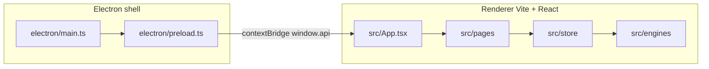

# Architecture and modules

This document maps the **svgAnimeto** repository: runtime split, folders, and how major pieces interact. Paths are relative to the project root.

---

## High-level runtime

- **Main process** (`electron/main.ts`): creates `BrowserWindow`, application menu, delegates file dialogs and IPC registration.
- **Preload** (`electron/preload.ts`): exposes a typed, minimal `window.api` via `contextBridge`.
- **Renderer** (`src/`): React UI, Zustand stores, pure TS **engines** for geometry, import/export, and animation math.

---

## Electron: main, preload, and IPC

| File | Role |
|------|------|
| `electron/main.ts` | Window lifecycle, menu (New / Open / Save / Import SVG / Import raster), shell integration. |
| `electron/preload.ts` | Defines `ElectronAPI`: `openProject`, `saveProject`, `projectLibrary` (list/read/write/delete/openFromDialog), `importSvg`, `importRaster`, `exportSvg`, `saveExport`, `onMenuAction`, `onImportSvgData`, `onImportRasterData`. |
| `electron/ipc.ts` | Registers `ipcMain` handlers invoked by preload (`dialog:*`, `projectLibrary:*`). |
| `electron/projectLibrary.ts` | Project records on disk / app user data (implementation details for library persistence). |

**Security posture**: no `nodeIntegration` in the renderer; capability is narrow IPC only. See comments in preload for early subscription to import events.

---

## Build and configuration

| File | Role |
|------|------|
| `electron.vite.config.ts` | electron-vite entries for **main**, **preload**, and **renderer**. |
| `tsconfig.json` | Base TypeScript options; web/electron splits in `tsconfig.web.json`, `tsconfig.node.json`, `tsconfig.electron.json`. |
| `package.json` | Scripts, dependencies, `electron-builder` metadata under `"build"`. |
| `eslint.config.js` | Lint rules for TS/TSX. |

Compiled output for production lives under `out/` (main + preload + renderer bundles).

---

## Renderer entry and routing

| Path | Role |
|------|------|
| `src/main.tsx` | React root mount. |
| `src/App.tsx` | `HashRouter`, routes: home and editor. |
| `src/navigation.ts` | Route path helpers (`routes`, `editorPath`, `navigateApp`) and global navigate binding. |
| `src/components/NavigationBinder.tsx` | Connects React Router `useNavigate` to `setAppNavigate` for non-React modules (IPC helpers) that need navigation. |

**Routes**

| Path | Page | Notes |
|------|------|-------|
| `/` | `LandingPage` | Marketing-style intro (animated hero, feature grid, comparison table, GitHub CTA). |
| `/dashboard` | `DashboardPage` | Project library UI (`HomeScreen` + `DialogHost`). |
| `/editor/:projectId` | `EditorPage` | Loads project JSON by id from storage; URL persistence so editor sessions are bookmarkable. |
| `*` | — | `Navigate` redirect to `/`. |

---

## Pages

| Path | Role |
|------|------|
| `src/pages/LandingPage.tsx` | Public landing page. GSAP intro tween + ScrollTrigger reveals, feature grid, comparison table, footer CTAs to `/dashboard` and GitHub. Styles live in `src/styles/landing.css`. |
| `src/pages/DashboardPage.tsx` | Thin wrapper around `HomeScreen` + `DialogHost`. |
| `src/pages/EditorPage.tsx` | Full editor chrome: loads project on `projectId`, wires menu IPC, keyboard shortcuts, layout grid, `Canvas`, `TopBar`, panels, export dialog, **pre-rendered preview overlay**, symbol banner, dev GSAP panel. |

---

## State management (`src/store/`)

| Module | Role |
|--------|------|
| `editorStore.ts` | **Primary document + timeline store**: `project` (`elements`, `symbols`, `gradients`, …), `tracks`, `currentTime`, `duration`, `mode`, `activeTool`, selection, history (undo/redo), symbol-edit backup, canvas guides, keyframe selection/clipboard, import helpers, serialization (`serializeProject`, `hydrateFromJson`). Notable actions: `updateTransform` (pivot-preserving rotation/scale via `getLocalShapeCenter` + `sampleMergedTransformForElement`), `setElementNoise`, `setElementTextureBrush`, `bakeTracksAtZero` (called when entering Draw mode), `createSymbolFromSelection` (carries source tracks into the new symbol's `animation`), `beginSymbolEdit`/`commitSymbolEdit` (load/persist the symbol's own timeline), `importSvgFromString` (merge as new group, remap IDs / motion paths). |
| `sessionStore.ts` | **Active project storage URI** — ties the open editor tab to `ProjectStoragePort` read/write. |
| `dialogStore.ts` | Modal alert/confirm API used across IPC and UI. |
| `traceOverlayStore.ts` | Raster trace progress overlay state. |
| `rasterImportModalStore.ts` | Raster import / vectorize wizard modal. |

---

## IPC and file orchestration (`src/ipc/`)

| Module | Role |
|--------|------|
| `fileActions.ts` | **User-facing file ops**: `openProjectFile`, `saveProjectFile`, `newProjectFile`, `importSvgFile`, `applyImportedSvg`, raster wizard entry (`openRasterVectorizeWizard`, `importRasterTraceFile`), trace overlay coordination, clipboard fallbacks when `window.api` is missing. |
| `projectActions.ts` | **Project lifecycle**: `loadProjectForEditor`, `createNewProjectAndOpen`, `openStoredProject`, `openProjectFromDialog`, `importProjectJsonFromFile`, `saveActiveProject`, `returnToHome`. Guards symbol-edit mode where needed. |

These modules call `getProjectStorage()` and `window.api` without importing Node APIs (renderer-safe).

---

## Project storage (`src/services/projectStorage/`)

Abstracts “where projects live” so the UI stays identical in Electron and browser.

| Module | Role |
|--------|------|
| `types.ts` | `ProjectRecord`, `ProjectStorageUri`, `ProjectStoragePort` interface. |
| `getProjectStorage.ts` | Returns **electron** library adapter when `window.api.projectLibrary` exists; otherwise **IndexedDB** adapter. |
| `electronProjectStorage.ts` | IPC-backed list/read/write/delete + open from OS dialog. |
| `indexedDbProjectStorage.ts` | Browser-local persistence for the same record shape. |
| `projectCodec.ts` | Small JSON helpers (`projectNameFromJson`, `ensureProjectIdInJson`, …). |
| `resolveProject.ts` | Resolve a `ProjectRecord` by id from the active backend. |

---

## Types (`src/types/`)

| File | Contents |
|------|----------|
| `document.ts` | `Project`, `VectorElement` (with optional `noise?: NoiseDef[]` and `textureBrush?: TextureBrush`), `Transform`, `SymbolDefinition` (with optional self-contained `animation`), element types, path points. |
| `animation.ts` | `AnimationTrack`, `Keyframe`, `AnimatableProperty`, `EasingId`, `NoiseProperty`, `NoiseDef`, clipboard types. |
| `texture.ts` | `TextureBrush`, `TextureBrushPresetId`, `TextureBrushOrient` — config for the per-element texture stamp engine. |
| `gradient.ts` | Gradient definitions used by the document model. |
| `canvasGuide.ts` | Guide types and normalized guide points. |
| `history.ts` | Undo/redo snapshot typing. |
| `electron.d.ts` | Augments `Window` with optional `api` matching preload. |

---

## Engines (`src/engines/`)

Pure (or mostly pure) logic — no React. Grouped by domain.

### `engines/animation/`

| Module | Role |
|--------|------|
| `interpolate.ts` | Sample tracks, merge transforms from keyframes. |
| `attrAnimation.ts` | Attribute-driven animation (text steps, packed colors). Colour interpolation is done in **linear-light RGB** via `srgbToLinear`/`linearToSrgb` for perceptually accurate transitions. |
| `gsapTrackCompiler.ts` | Dev-oriented compilation of tracks to GSAP timeline (optional `gsapCanvasDriver` path). |
| `motionPathApply.ts` | Apply motion-path offset along SVG paths. Pivots on the element's **local bbox centre** (via `getLocalShapeCenter`) so a layer following a path with rotation spins around its own middle, not its origin. |
| `noise.ts` | Deterministic 1-D value-noise generator (`valueNoise01`, `fractSin`) + `applyNoiseToTransform(transform, noise[], time)` that layers wiggle on top of the merged keyframe transform. |
| `syncDocument.ts` | Keep document state in sync with playback sampling when needed. |

### `engines/document/`

| Module | Role |
|--------|------|
| `tree.ts` | Find, insert, remove, reorder, flatten for layers, purge by ids. |
| `duplicateElements.ts` | Duplicate selected subtrees with new ids. |
| `groupElements.ts` | Group selected root elements. |
| `symbolClone.ts` | Deep clone / unlock for symbol templates and instances. |

### `engines/export/`

| Module | Role |
|--------|------|
| `exportSvg.ts` | Build animated SVG string with embedded CSS keyframes. Filters out `visible: false` branches via `filterVisibleTree`. `renderTextureBrushSvg` bakes texture-brush stamps into the output as concrete `<path>` nodes so the SVG stays JS-free. |
| `exportHtml.ts` | Standalone HTML export. |
| `keyframeCss.ts` | CSS generation helpers for keyframed properties. |
| `rasterizeAnimation.ts` | Frame rasterization for GIF/video export and the pre-rendered preview. `drawSvgFrameToCanvas` rasterises one frame; `exportAnimatedGifBytes`/`exportAnimatedVideoBlob` walk all frames with progress + frame-budget caps. |

### `engines/geometry/`

| Module | Role |
|--------|------|
| `svgWorldTransform.ts` | World matrices for SVG elements. |
| `pathBooleanEngine.ts` / `polygonClippingApi.ts` | Path booleans via polygon clipping. |
| `eraserApply.ts` | Apply eraser using clipping tree updates. |
| `rasterBucketFill.ts` / `pointInMultiPolygon.ts` | Fill tool hit testing and flood regions. |
| `pathFlatten.ts` | Stroke outline / flattening utilities. |
| `pencilPath.ts` | Pencil stroke simplification + **editable anchors**. `buildPencilStroke(raw, smoothing)` returns both a `d` string and a `PathPoint[]` array (centripetal Catmull–Rom handles) so freehand strokes can be edited with the path-edit tool. |
| `localShapeBounds.ts` | `getLocalShapeBBox` / `getLocalShapeCenter` — closed-form bbox for `rect`/`circle`/`ellipse`/`line`/`image`, cached DOM `getBBox` fallback for `path`/`polygon`/`polyline`. Used for pivot-preserving rotation/scale and motion-path centring. |
| `shapeToPath.ts` | Convert primitives to path data. |
| `svgPathMotion.ts` | Motion along path geometry. **Centripetal Catmull–Rom → cubic Bézier** segment helper used by `morphPathDApprox` for smooth `d` morphs. |
| `transformMultiPolygon.ts` | Transform multipolygons for ops. |

### `engines/importer/`

| Module | Role |
|--------|------|
| `svgImporter.ts` | Parse SVG string into internal `VectorElement` trees. |
| `rasterTrace.ts` / `rasterTraceOptions.ts` / `rasterTraceSettings.ts` | Bitmap-to-vector tracing pipeline and wizard settings. |
| `imagePreprocess.ts` | Preprocess steps before trace. |

### `engines/texture/`

| Module | Role |
|--------|------|
| `textureBrushes.ts` | Texture brush engine. Defines `TEXTURE_BRUSH_PRESETS` (pencil, charcoal, brush, marker, crayon, ink, fur, grass) with hand-tuned stamp `d` paths + sensible defaults, `sampleTextureStamps(d, brush)` (DOM-cached path measurement + deterministic per-stamp jitter via seeded `fractSin`), `extractGuidePathD(type, attrs)` to derive a `d` string from path/polyline/polygon/line, `resolveStampColor` (inherits stroke/fill when no override), `defaultTextureBrush(presetId, seed)`. Per-path measurements are cached in a small LRU keyed by `d`. |

### `engines/preview/`

| Module | Role |
|--------|------|
| `previewEngine.ts` | Drive preview playback sampling (still used by other code paths). The fullscreen preview overlay now uses `usePreRenderedFrames` (see Hooks) for jitter-free playback. |

---

## Workers (`src/workers/`)

| File | Role |
|------|------|
| `rasterTrace.worker.ts` | Off-main-thread raster tracing to keep UI responsive. |

---

## React components (`src/components/`)

High-level grouping (not every file listed):

| Area | Examples | Role |
|------|----------|------|
| Canvas | `canvas/Canvas.tsx`, `ElementRenderer.tsx`, `SelectionOverlay.tsx`, `CanvasGuideOverlay.tsx`, `TexturedStrokeLayer.tsx`, `CanvasZoomControls` (inside `Canvas.tsx`) | Render SVG document, selection handles, guides, texture-brush stamps, zoom in/out/fit-to-screen controls. `SelectionOverlay` auto-hides while `isPlaying` so it doesn't obscure motion. `Canvas` lets drawing tools (pen / pencil / brush / shapes / eraser / text) draw through existing layers via `shouldDrawThrough`. |
| Toolbar / chrome | `LeftToolbar.tsx`, `TopBar.tsx`, `ResizeHandle.tsx` | Modes, tools, import/save, layout. Tools that don't apply in Animate/Preview are filtered out of the toolbar. `TopBar` allows Draw/Animate/Preview while editing a symbol; only Export is blocked. |
| Panels | `LayersPanel.tsx` (visual-stacking order, top row = front of canvas), `SymbolsPanel.tsx`, `Timeline/TimelinePanel.tsx` (per-track trash button) | Structure and time editing. |
| Inspector | `RightInspector.tsx` | Collapsible sections for Layer, Layout (multi-select alignment + shape builder), Transform, Animation (+ Browse presets), **Noise**, **Texture brush**, Symbol, Geometry, Appearance, Typography, Effects, Advanced, Canvas guides. Hosts the `NoiseEditor` and `TextureBrushEditor` sub-components. |
| Modals / dialogs | `ExportDialog.tsx`, `RasterImportModal.tsx`, `DialogHost.tsx`, `TraceOverlay.tsx`, `AnimationPresetsModal.tsx` | Export flow, raster wizard, global dialogs, trace progress, **animation preset browser** (two-pane preset grid + live preview + per-preset config). |
| Preview | `preview/PreviewFullscreenOverlay.tsx`, `preview/usePreRenderedFrames.ts` | Pre-renders every frame to `ImageBitmap` at the project FPS, then plays cached frames on a `<canvas>` driven by `usePlaybackLoop`. Progress overlay during the bake; scrub slider, loop, speed, re-render. |
| Dev | `dev/GsapTimelineDevPanel.tsx` | Development aid for GSAP timeline. |
| Brand | `brand/SvgAnimetoLogo.tsx`, `constants/brand.ts` | Naming / logo / GitHub link. |

---

## Hooks (`src/hooks/`)

| Hook | Role |
|------|------|
| `usePlaybackLoop.ts` | GSAP-ticker-driven playback tick tied to `editorStore` (`isPlaying`, `currentTime`, `playbackSpeed`, `loop`, `duration`). Single source of truth for "what time is the playhead at?", shared by the editor canvas, the timeline, and the pre-rendered preview overlay. |
| `useWorkspaceLayout.ts` | Persisted sizes for inspector / bottom panels. |

Component-scoped hooks:

| Hook | Module | Role |
|------|--------|------|
| `usePreRenderedFrames` | `src/components/preview/usePreRenderedFrames.ts` | Bakes every animation frame to an `ImageBitmap` ahead of playback. Returns a state machine (`idle | rendering | ready | error`). Caps memory via `FRAME_BUDGET` (720) and `MAX_SIDE` (1280 px). Cancellation token releases in-flight bitmaps on input change / unmount. Used by `PreviewFullscreenOverlay`. |

---

## Vendor

| Path | Role |
|------|------|
| `src/vendor/imagetracer_v1.2.6.js` | Image tracing library (legacy script bundled for trace). |

---

## Data flow summary

1. **User** edits canvas → events in `Canvas` / overlays → **`editorStore`** mutations (often after **engines** compute new geometry). `updateTransform` auto-folds in pivot-preserving translation so rotation/scale around the bbox centre is the default.
2. **Playback** → `usePlaybackLoop` advances `currentTime` → sampling via **`interpolate`** / **`attrAnimation`** / **`noise`** / **`motionPathApply`** flows into the renderer (Draw/Animate) or paints the matching pre-rendered bitmap (Preview).
3. **Render** → `ElementRenderer` samples the merged transform, layers noise on top, applies motion path, then renders the shape and (when present) the `TexturedStrokeLayer` inside the same `<g>` so transforms carry the stamps along.
4. **Save** → `serializeProject()` JSON → **`ProjectStoragePort.write`** or Electron **`saveProject`** dialog path.
5. **Export** → `ExportDialog` calls **`exportSvg` / `exportHtml` / `rasterizeAnimation`** → `window.api.saveExport` or browser download. Hidden layers are stripped (`filterVisibleTree`); textures are baked (`renderTextureBrushSvg`).

---

## Adding a new feature (checklist)

1. **Types**: extend `document.ts` / `animation.ts` / `texture.ts` if the file format changes. Optional per-element data lives as a typed field on `VectorElement` (e.g. `noise`, `textureBrush`) rather than untyped entries in `attrs`.
2. **Engine**: put deterministic logic under `src/engines/...` (one folder per domain) and unit-test if you add tests later.
3. **Store**: expose actions on `editorStore`; push history where user-visible edits occur. Mirror the `setElementNoise` / `setElementTextureBrush` pattern for per-element optional configs.
4. **Renderer**: add the visual layer inside the host's `<g>` in `ElementRenderer` so it inherits transforms, motion path, and animation.
5. **UI**: wire React components; keep IPC in `src/ipc/` only. Inspector sections get an entry in `InspectorSectionId` + `defaultOpenSections`.
6. **Export**: if the feature has visual output, bake it into `exportSvg` (and rasterization) so exports match what users see in Preview.
7. **Docs**: update [user-guide.md](user-guide.md) and this file when behaviour or layout changes.

---

## Related files

- Root [README.md](../README.md)
- [REQUREMENT.md](../REQUREMENT.md)
